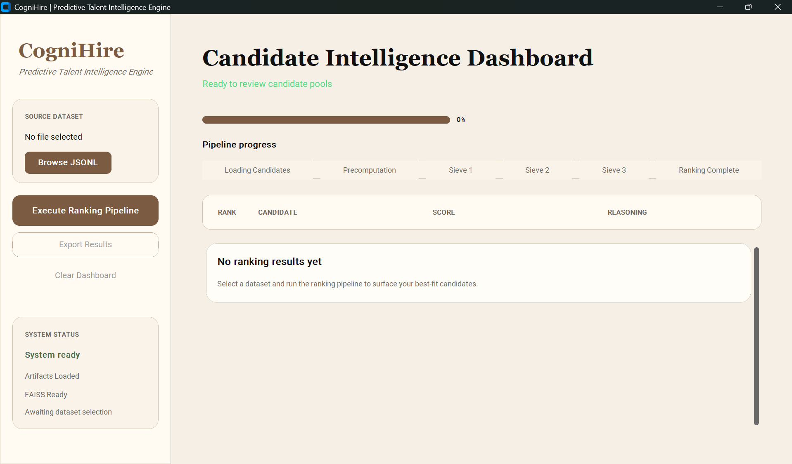
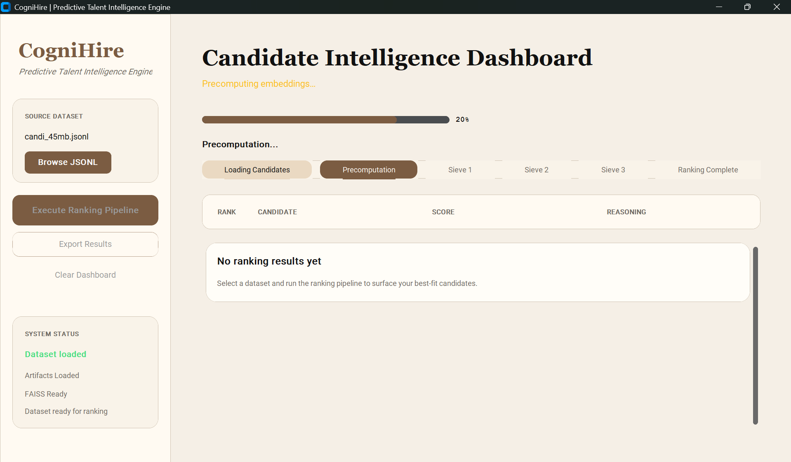
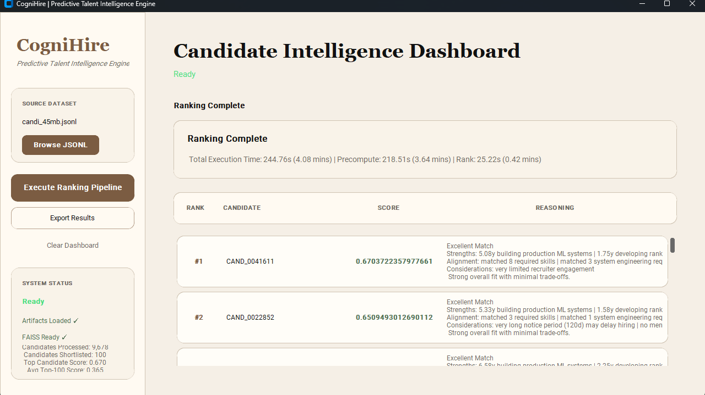

# 🚀 CogniHire – Predictive Talent Intelligence Engine

> **Built for the Redrob Intelligent Candidate Discovery Challenge**

CogniHire is an AI-powered candidate ranking engine that discovers high-quality talent by combining **semantic retrieval, structured career trajectory analysis, behavioral intelligence, and neural reranking**.

Unlike traditional ATS systems that rely on keyword matching, CogniHire evaluates **what candidates have built, how their careers have progressed, and how closely they align with the hiring intent of a Job Description**.

---

# ✨ Features

- 🔍 Semantic Candidate Retrieval using Sentence Transformers + FAISS
- 📈 Career Trajectory Analysis
- 🧠 Dynamic Job Description Understanding
- 🎯 Behavioral Signal Modeling
- 🤖 CrossEncoder Precision Reranking
- 📊 Explainable AI Reasoning
- ⚡ CPU-only Inference
- 🖥 Modern Desktop GUI (CustomTkinter)
- 🐳 Docker Support
- 📦 uv Package Management

---

# 🎯 Challenge Objectives

CogniHire was designed for the Redrob AI Hiring Challenge while satisfying strict production constraints.

- ✅ Generate an explainable Top-100 candidate ranking
- ✅ CPU-only execution
- ✅ ≤16 GB RAM
- ✅ Offline inference
- ✅ Explainable rankings
- ✅ Robust against honeypot profiles

---

# 🏗 System Architecture

```text
Candidate JSONL
        │
        ▼
Rich Candidate Builder
        │
        ▼
SentenceTransformer Embeddings
        │
        ▼
━━━━━━━━━━━━━━━━━━━━━━━━━━━━━━━━━━━━━━
SIEVE 1
Semantic Recall
FAISS (Cosine Similarity)
━━━━━━━━━━━━━━━━━━━━━━━━━━━━━━━━━━━━━━
        │
        ▼
━━━━━━━━━━━━━━━━━━━━━━━━━━━━━━━━━━━━━━
SIEVE 2
Candidate Intelligence Engine
━━━━━━━━━━━━━━━━━━━━━━━━━━━━━━━━━━━━━━

• Career Trajectory Analysis
• Production ML Detection
• Search / Recommendation Detection
• Ranking Experience
• Product Company Detection
• Consulting Ratio Analysis
• Behavioral Signals
• Honeypot Detection
• Dynamic JD Matching

        │
        ▼
━━━━━━━━━━━━━━━━━━━━━━━━━━━━━━━━━━━━━━
SIEVE 3
CrossEncoder Precision Reranking
━━━━━━━━━━━━━━━━━━━━━━━━━━━━━━━━━━━━━━
        │
        ▼
Score Fusion

60% CrossEncoder

25% Intelligence Engine

15% Career Trajectory

        │
        ▼
Reasoning Generator
        │
        ▼
Top-100 Ranked CSV
```

---

# 🔍 Pipeline

## Sieve 1 – Semantic Recall

Uses **SentenceTransformer embeddings** together with **FAISS cosine similarity** for fast semantic retrieval.

Each candidate is represented as a rich semantic profile containing:

- Professional Summary
- Skills
- Experience
- Projects
- Career History
- Behavioral Metadata

This allows retrieval based on **meaning**, not keyword overlap.

---

## Sieve 2 – Candidate Intelligence

This stage evaluates candidate quality using structured features.

### Career Trajectory Engine

Extracts features such as:

- Production ML Years
- Ranking System Experience
- Search / Recommendation Experience
- NLP Experience
- Product Company Experience
- Consulting Ratio
- Career Stability
- Leadership Progression
- Vector Database Usage
- Evaluation Frameworks

### Behavioral Intelligence

Uses recruiter signals including:

- Open to Work
- Recruiter Response Rate
- Notice Period
- Profile Completeness
- Interview History

### Production Readiness

Rewards candidates who have shipped real systems instead of only research projects.

---

## Sieve 3 – Neural Precision

Uses a **CrossEncoder** to perform token-level comparison between the Job Description and candidate profile for high-precision reranking.

---

# 🎯 Final Ranking Score

Rather than relying on a single model, CogniHire combines multiple signals.

```
Final Score

=

0.60 × CrossEncoder

+

0.25 × Candidate Intelligence

+

0.15 × Career Trajectory
```

---

# 🧠 Dynamic JD Understanding

CogniHire automatically extracts structured hiring intent from the uploaded Job Description.

It extracts:

- Required Skills
- Preferred Skills
- Experience Range
- Production Requirements
- System Requirements
- Behavioral Preferences
- Disqualifiers

Candidates are evaluated against these requirements instead of relying on keyword matching.

---

# 💡 Explainable AI

Every recommendation includes a structured explanation grounded in extracted candidate data.

Example:

> **Excellent Match:** Senior Machine Learning Engineer with 6.8 years of experience. Built production ML systems for 5.2 years with 3.4 years of ranking/search experience. Strong product-company background, hands-on vector database deployment, and high alignment with required JD skills.

Reasoning is generated deterministically from verified candidate profile attributes without relying on external LLM APIs.

---

# 🛠 Tech Stack

| Component | Technology |
|------------|------------|
| Language | Python 3.13 |
| Package Manager | uv |
| Embeddings | Sentence Transformers |
| Vector Search | FAISS CPU |
| Neural Reranking | CrossEncoder |
| Data Processing | Pandas |
| Desktop UI | CustomTkinter |
| Deployment | Docker |

---

# 📂 Project Structure

```text
CogniHire/
├── app.py
├── Dockerfile
├── pyproject.toml
├── uv.lock
├── validate_submission.py
├── submission_metadata.yaml
├── team_PixelPioneers.csv
│
├── artifacts/
│
│
├── sample/
│   └── sample_candidates.jsonl (for testing in sandbox(docker))
│
│
├── src/
│   ├── config.py
│   ├── loader.py
│   ├── pipeline.py
│   ├── precompute.py
│   ├── trajectory_engine.py
│   ├── sieve_engine.py
│   ├── jd_parser.py
│   ├── ranker.py
│   ├── res_gen.py
│   └── text_builder.py
│
└── README.md
```

---

# 🚀 Installation

Install **uv**

```bash
curl -LsSf https://astral.sh/uv/install.sh | sh
```

Clone the repository

```bash
git clone https://github.com/Code-0ne/CogniHire.git

cd CogniHire
```

Install dependencies

```bash
uv sync
```

---

# 🖥 Desktop Application

Launch the desktop interface

```bash
uv run app.py
```

The GUI allows users to:

- Upload Candidate JSONL
- Precompute candidate embeddings
- Build a Temporary FAISS Index
- Execute the Complete Ranking Pipeline
- Export the Top-100 Ranked CSV

---

# ⚡ Offline Precomputation

For large datasets:

```bash
uv run python -m src.precompute
```

This generates:

```text
artifacts/
├── embeddings.npy
├── faiss.index
└── jd_embedding.npy
```

---

# 🏆 Ranking

Generate the final ranked CSV

```bash
uv run python -m src.ranker --out submission.csv
```

---

# 🚀 Reproduce Submission CSV

Generate the submission CSV from a clean clone.
```
uv sync

uv run python -m src.precompute ; uv run python -m src.ranker --out submission.csv

```
This reproduces the submission CSV used for the hackathon.

---

# 🐳 Docker

## Pull Image

```bash
docker pull rwitabrato/cognihire:latest
```

## Run

```bash
docker run --rm -p 6080:6080 rwitabrato/cognihire:latest
```

Open:

```
http://localhost:6080/vnc.html
```

The Docker container launches the CogniHire interface where you can:

- Upload Candidate JSONL
- Run the ranking pipeline
- Export the ranked CSV

---

# ⚙ Compute Requirements

Designed for CPU-only execution.

- Designed for deterministic offline CPU-only execution
- Offline Inference
- ≤16 GB RAM
- No External APIs
- Fully Reproducible

---
# 📸 Application Preview



During Computation:



After Ranking:



---

# 👥 Team

### Rwitabrato Hanpal

GitHub: https://github.com/GhostisLive

### Anushka Ghosh

GitHub: https://github.com/Code-0ne

---

# 📜 License

Developed for the **Redrob Intelligent Candidate Discovery Challenge**.